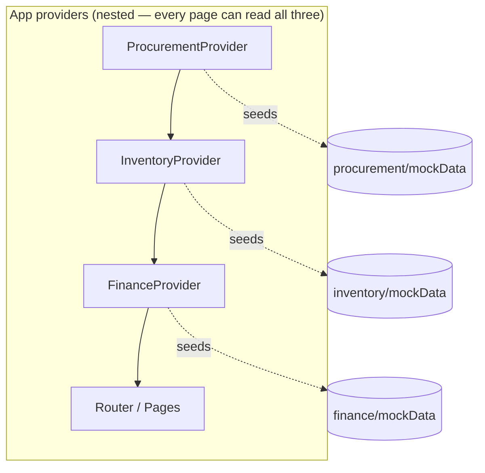
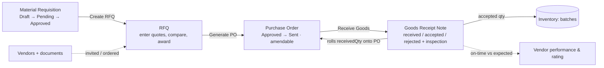
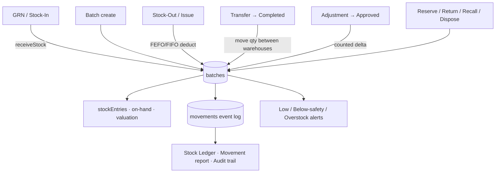
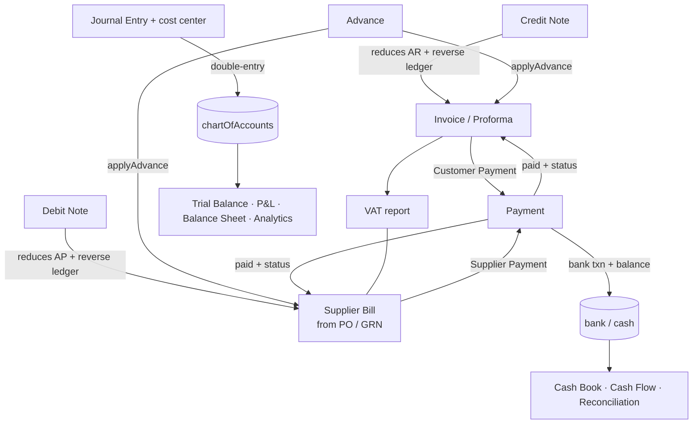

# PharmaCo ERP — System Flow & MVP Coverage

Phase-1 pharmaceutical ERP: **Procurement · Inventory · Billing & Finance**.
This document explains how data flows through the system and maps every feature back to the
Phase-1 Workflow & Requirements PDF. **Every Phase-1 line item is now implemented** — all with
real effects on stored data or derived from real records (no fabricated numbers).

- **Live:** https://pharmamntr.vercel.app
- **Repo:** https://github.com/saliltimalsina/Pharma

---

## 1. Architecture

React 19 + TypeScript + Vite + MUI v9. **No backend** — all data lives in memory in three
React Context stores, seeded once from `mockData.ts` files. Everything you create/approve/post
during a session persists in the store and cascades across screens. History (movement ledger,
audit trails, cash flow) is kept in **in-memory event-log arrays** that grow as you act — so no
server is needed; a page refresh resets to seed data.



Because the providers are nested, any page reaches `useProcurement()`, `useInventory()` and
`useFinance()` at once — that is what powers the **cross-module cascades** (GRN → stock, PO → bill,
payment → bank) without a backend.

### Source-of-truth rule
Each store owns all of its module's transactional data, and every action mutates the *connected*
data other screens render — nothing "looks saved but isn't", and no metric is a hardcoded number.

| Concern | Source of truth | Derived from it |
|---|---|---|
| Stock quantity | `batches` | `stockEntries`, item on-hand, valuation, low/safety/overstock alerts |
| Stock history | `movements` event log | Stock Ledger, movement reports, inventory audit trail |
| Account balances | `chartOfAccounts` | Trial Balance / P&L / Balance Sheet |
| Bank balances | `bankAccounts` + `bankTransactions` | Banking KPIs, cash book, cash flow, reconciliation |
| Vendor rating | computed from `purchaseOrders` + `grns` | on-time %, lead time, rejected %, composite rating |
| Audit trails | per-module event logs | audit reports |

All store actions are React StrictMode-safe (no side effects inside `setState` updaters).

---

## 2. Procurement flow



- **Requisition** → create (department-wise), submit, approve/reject.
- **RFQ** → prefilled from an approved requisition; **enter a real quote per invited vendor**, auto-scored, compare, **award**.
- **PO** → generated from the awarded RFQ; approve, send; **amend** (Draft/Pending) with amendment history.
- **GRN** → received/accepted/rejected per line + **inspection** pass/fail; advances the PO, records **on-time vs expected delivery**, and cascades accepted goods into Inventory.
- **Vendors** → directory + editable documents. **Rating & performance are derived from real GRN/PO data** — on-time %, avg lead time, rejected %, composite rating; a vendor with no receipts shows "Not yet rated" (never a fake number).
- **Reports** → Pending, **Vendor Performance**, **Cost Analysis**, **Audit** — all derived, with CSV.

---

## 3. Inventory flow (the stock engine)



- **Stock-In / GRN** create or top-up batches. **Stock-Out/Issue** deducts across batches in **FEFO/FIFO** order (per item).
- **Transfers** move quantity between warehouses on completion; **Adjustments** apply the counted delta on approval.
- **Reserve / Return / Recall / Dispose** move real batch quantities.
- Every quantity change writes to the **`movements` ledger**, which powers the **Stock Ledger**, movement reports, and inventory **audit trail**.
- **Alerts** (low / below-safety / overstock) derive live from on-hand vs each item's reorder / safety / max levels.
- Items carry **stock type** (raw / packaging / WIP / finished), **barcode** (rendered + printable), editable **bins**, and FEFO/FIFO costing.

---

## 4. Billing & Finance flow



- **Invoices / Bills / Payments** — payments update the document's paid + status and write a bank (or cash) transaction. **Vouchers** (receipt/payment) print from a payment.
- **Credit / Debit notes** reduce AR / AP and post the reverse ledger effect. **Proforma** invoices stay out of AR until converted. **Advances** create an unallocated party credit that can be applied later.
- **Accounting** — GL, Chart of Accounts, Journal Entries (double-entry, with **cost center**), AR/AP.
- **Banking** — accounts, transactions, **reconciliation toggle**, **Cash Book**, **Cash Flow statement** — all from dated records.
- **Taxes** — VAT collected/paid/payable + a period **VAT report** from real invoice/bill lines.
- **Reports & Analytics** — Trial Balance, P&L, Balance Sheet, Sales/Purchase, Outstanding, revenue/expense/cost-center **Analytics**, and an **Audit report** — all derived, with CSV.

---

## 5. PDF coverage

**All 87 Phase-1 line items are implemented.** Legend: ✅ Done · 🟡 Basic (works at MVP depth).

### 1 — Procurement Management
| Requirement | Status | Note |
|---|---|---|
| Requisition creation · department-wise · approval · tracking | ✅ | |
| Vendor registration · categorization · documentation | ✅ | Documents editable in-app |
| Vendor performance evaluation · rating & scoring | ✅ | **Derived** from real GRN/PO data |
| RFQ generation · quotation submission · comparison · selection | ✅ | Quotes entered per vendor, auto-scored, awarded |
| PO creation · approval · amendments · tracking | ✅ | Amendment history kept |
| GRN · partial deliveries · inspection status · delivery tracking | ✅ | On-time vs expected recorded |
| Purchase / vendor-performance / cost / pending reports · history | ✅ | Derived + CSV |

### 2 — Inventory & Warehouse Management
| Requirement | Status | Note |
|---|---|---|
| Item master · categorization · UOM · barcode/QR | ✅ | Barcode rendered + printable |
| Multiple warehouses · locations · bin & rack · transfers | ✅ | Bins editable |
| Raw / packaging / WIP / finished · batch-wise stock | ✅ | Stock-type on every item |
| Stock In · Out · Transfer · Adjustment · Returns | ✅ | All move real quantity + log movements |
| Batch # · mfg / expiry · FEFO/FIFO · recall | ✅ | FEFO/FIFO used on issue & reserve |
| Reorder · safety-stock · low-stock · overstock · expiry alerts | ✅ | Derived live |
| Stock / batch valuation · movement reports · stock ledger · audit trail | ✅ | From `movements` ledger |

### 3 — Billing & Finance Management
| Requirement | Status | Note |
|---|---|---|
| Sales invoice · batch-wise · credit notes · debit notes · proforma | ✅ | Notes adjust AR/AP + ledger |
| Supplier invoice recording · verification · payment · outstanding payable | 🟡 | Verification = PO/GRN match indicators |
| Customer / supplier / advance / partial payments · reconciliation | ✅ | Advances applyable; reconcile toggle |
| GL · Chart of Accounts · Journal · AP · AR | ✅ | Journal posts move balances |
| Cash book · bank book · reconciliation · payment/receipt vouchers | ✅ | Cash book + vouchers from real data |
| VAT management · calculations · tax reports · purchase/sales VAT | ✅ | VAT report from lines |
| Trial Balance · P&L · Balance Sheet · Cash Flow · sales/purchase/outstanding | ✅ | Derived; cash flow from dated records |
| Revenue / expense / cost-center analytics · dashboards · audit reports | ✅ | From ledger + event log |

---

## 6. How it stays honest (no fakes)

Everything shows data the system actually produces:

- **Vendor rating** is computed from real receipts (on-time delivery, rejected %, lead time) — the earlier hardcoded "4.6/5" was deleted and rebuilt as a real derivation.
- **History** (stock ledger, audit trails, cash flow, cash book) comes from **event-log arrays** appended on every action — real records, just held in memory.
- **Reports & analytics** are derived from the stores, never literal arrays.
- Metrics with no data yet degrade honestly (e.g. "Not yet rated") instead of showing an invented number.

### Limits (by design, no backend)
- In-memory: all data — including event logs — **resets on page refresh**.
- Quote submission is entered in-app (no external vendor portal).
- Purchase-invoice verification is PO/GRN match indicators, not a tolerance-based 3-way match.

---

## 7. Running

```bash
npm install
npm run dev      # local dev server
npm run build    # tsc -b && vite build  (passes clean)
```

Navigation: top-level **Dashboard**, then three groups — **Procurement**, **Inventory**,
**Billing & Finance** — each with its own Dashboard + screens.
