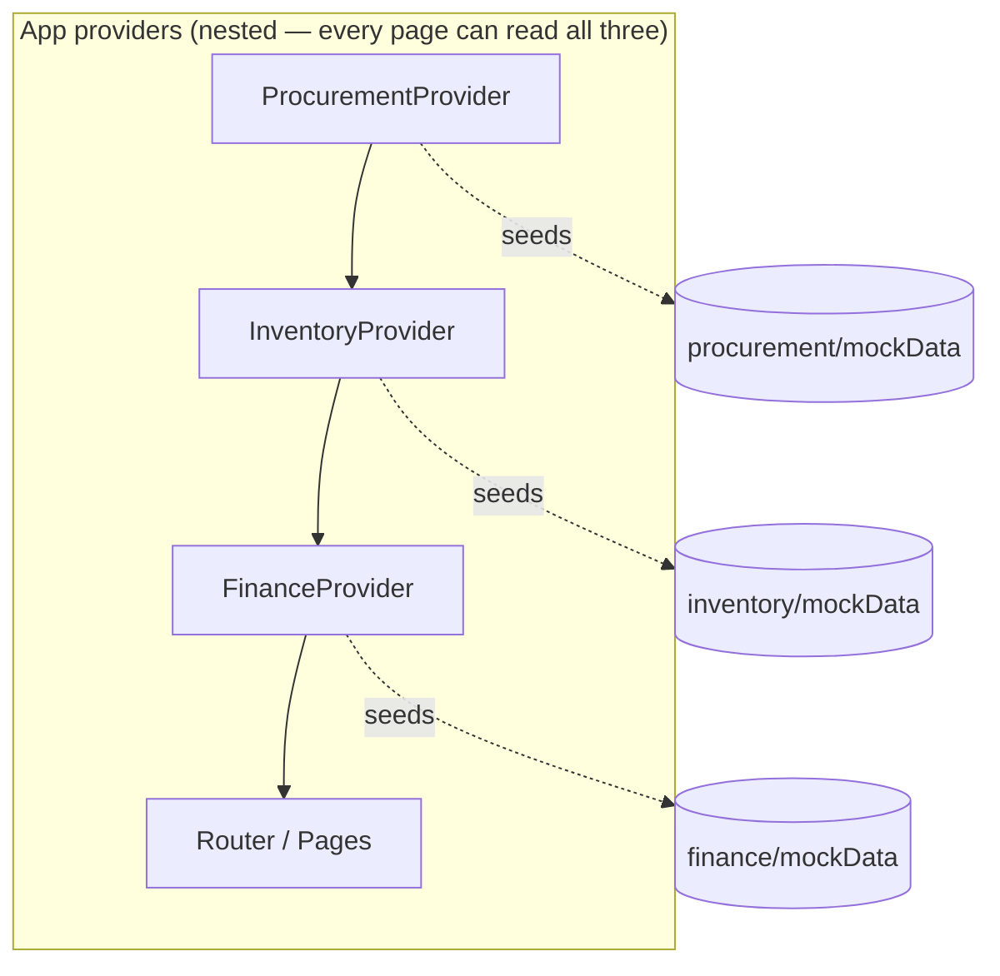
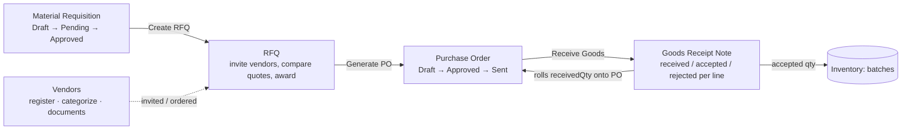
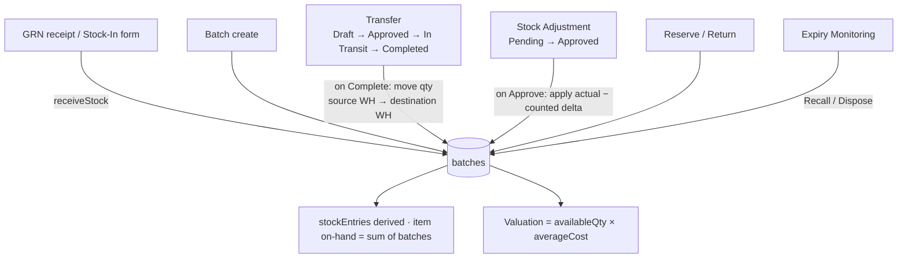
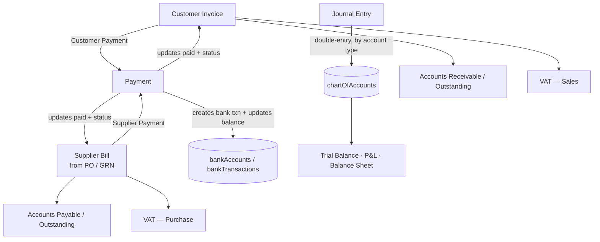

# PharmaCo ERP — System Flow & MVP Coverage

Phase-1 MVP of a pharmaceutical ERP: **Procurement · Inventory · Billing & Finance**.
This document explains how data flows through the system and maps every feature back to the
Phase-1 Workflow & Requirements PDF.

- **Live:** https://pharma-erp-topaz.vercel.app
- **Repo:** https://github.com/saliltimalsina/Pharma

---

## 1. Architecture

React 19 + TypeScript + Vite + MUI v9. **No backend** — all data lives in memory in three
React Context stores, seeded once from `mockData.ts` files. Everything you create/approve during
a session persists in the store and cascades across screens; a page refresh resets to seed data.



Because the providers are nested, any page reaches `useProcurement()`, `useInventory()` and
`useFinance()` at once — that is what makes the **cross-module cascades** (GRN → stock, PO → bill,
payment → bank) possible without a backend.

### Source-of-truth rule
Each store owns **all** of its module's transactional data, and every action mutates the *connected*
data other screens render — no "looks saved but isn't". Key decisions:

| Concern | Source of truth | Everything else |
|---|---|---|
| Stock quantity | `batches` (per batch: available/reserved/damaged/returned) | `stockEntries` is **derived** from batches; item on-hand = sum of its batches |
| Account balances | `chartOfAccounts` | Trial Balance / P&L / Balance Sheet all derive from it |
| Bank balances | `bankAccounts` + `bankTransactions` | Banking KPIs derive from them |

All store actions are **React StrictMode-safe** (no side effects inside `setState` updaters).

---

## 2. Procurement flow

The core chain runs left to right; each step hands its id forward to prefill the next
(`?fromReq`, `?fromRfq`, `?fromPo`).



- **Requisition** → create (department-wise), submit, approve/reject with approver + reason.
- **RFQ** → created from an approved requisition (items prefilled), invite vendors, compare quotes,
  **award** a vendor.
- **PO** → generated from the awarded RFQ (vendor + items prefilled), approve, send.
- **GRN** → created against a PO, capture received/accepted/rejected per line + batch/expiry.
  On **Complete Receipt** it (a) advances the PO to *Partially Received* / *Completed* by rolling
  accepted quantities onto the PO lines, and (b) **cascades accepted goods into Inventory** via
  `receiveStock` (creates/increments batches).
- **Vendors** → a lean directory (name, code, category, contact, country, status, outstanding
  balance, documents). Fabricated performance/rating metrics were removed (see §6).

---

## 3. Inventory flow (the stock engine)

Every transaction moves real quantities on `batches`; `stockEntries` and item on-hand recompute
automatically.



- **Stock-In** — receive goods into batches (also the target of the GRN cascade).
- **Transfers** — completing a transfer decrements the source-warehouse batch and
  creates/increments a same-numbered batch in the destination warehouse.
- **Stock Adjustment** — approving applies `actualQty − currentQty` to the batch (physical count
  reconciliation).
- **Reserve / Return / Recall / Dispose** — real quantity/state moves on the batch.
- **Expiry Monitoring** — live buckets (expired, ≤7/30/90 days) derived from batch expiry dates;
  recall/dispose act on the batch.
- **Items / Warehouses / Batches / Stock** — masters + read views; item stock, valuation, low-stock
  and expiry are all derived, never hardcoded.

---

## 4. Finance flow



- **Invoices / Bills** — bills can be created from a PO/GRN (match indicator). Both track amount,
  paid, and status.
- **Payments** — Customer or Supplier only (unwired advance/refund/adjustment types were removed).
  A payment updates the target invoice/bill's paid amount + status **and** writes a bank transaction
  and adjusts the bank balance.
- **Accounting** — Chart of Accounts, Journal Entries (a posted entry moves both account balances
  with correct double-entry sign), General Ledger, AR, AP.
- **Banking** — accounts, transactions (grow as payments post), reconciliation.
- **Taxes** — VAT collected/paid/payable derived from invoice & bill line VAT.
- **Financial Reports** — Trial Balance, P&L, Balance Sheet, Sales/Purchase, Outstanding
  receivables/payables — all derived from the stores, with CSV export.

---

## 5. PDF MVP coverage matrix

Legend: ✅ Done · 🟡 Partial (works, reduced for MVP) · ⚪ Cut for MVP (no real data source / gold-plated)

### 1 — Procurement Management
| PDF requirement | Status | Note |
|---|---|---|
| Material requisition creation | ✅ | |
| Department-wise requisitions | ✅ | |
| Approval workflow | ✅ | Draft → Pending → Approved/Rejected with approver |
| Purchase request tracking | ✅ | Status + detail |
| Vendor registration | ✅ | |
| Vendor categorization | ✅ | API/Excipients/Packaging/… |
| Vendor performance evaluation | ⚪ | Fabricated seed metrics — removed |
| Vendor rating & scoring | ⚪ | Was a hardcoded number, not computed — removed |
| Supplier documentation | 🟡 | Documents tab kept (list); no upload store |
| RFQ generation | ✅ | Prefills from requisition |
| Quotation submission | 🟡 | Seed quotes; no external vendor portal |
| Quotation comparison | ✅ | |
| Vendor selection | ✅ | Award → carries to PO |
| PO creation | ✅ | Prefills from awarded RFQ |
| PO approval workflow | ✅ | Approve / Send |
| Purchase amendments | ⚪ | Status transitions only, no revision history |
| PO tracking | ✅ | Status + receipts (receivedQty) |
| Goods Receipt Note (GRN) | ✅ | |
| Partial deliveries | ✅ | Per-line received qty → *Partially Received* |
| Material inspection status | 🟡 | Pass/fail capture; simplified |
| Supplier delivery tracking | 🟡 | Via GRN + PO status |
| Purchase reports | 🟡 | Real *Pending* view + CSV; analytics cut |
| Vendor performance reports | ⚪ | Depended on fabricated metrics |
| Purchase history | ✅ | PO/GRN lists |
| Procurement cost analysis | ⚪ | Was literal chart data |
| Pending purchase reports | ✅ | Derived |

### 2 — Inventory & Warehouse Management
| PDF requirement | Status | Note |
|---|---|---|
| Item master management | ✅ | Trimmed to real fields |
| Material / product categorization | ✅ | category + brand |
| UOM management | ✅ | |
| Barcode / QR support | ⚪ | No scanning in MVP |
| Multiple warehouse support | ✅ | |
| Warehouse location management | ✅ | |
| Bin & rack management | 🟡 | Bins on stock entries; decorative rack tree removed |
| Warehouse transfer management | ✅ | Moves real quantity between warehouses |
| Raw / packaging / WIP / finished stock | 🟡 | One item model with categories; no separate WIP stage |
| Batch-wise stock management | ✅ | Batches are the source of truth |
| Stock In | ✅ | Form + GRN cascade |
| Stock Out | 🟡 | Via transfer/adjustment/dispose; no sales-issue doc |
| Stock Transfer | ✅ | |
| Stock Adjustment | ✅ | Applies counted delta |
| Stock Returns | ✅ | `returnStock` |
| Batch number / mfg date / expiry | ✅ | |
| FEFO / FIFO handling | ⚪ | No auto-picking logic in MVP |
| Product recall support | ✅ | `recallBatch` |
| Reorder level management | ✅ | |
| Safety stock monitoring | ⚪ | Field removed (unused) |
| Low stock alerts | ✅ | Derived (on-hand ≤ reorder level) |
| Overstock alerts | ⚪ | No max-stock model |
| Expiry notifications | ✅ | Expiry Monitoring buckets |
| Stock / batch valuation | ✅ | availableQty × averageCost |
| Inventory movement reports | 🟡 | Receipts view; no full issue ledger |
| Stock ledger | 🟡 | Derived views, not an event log |
| Inventory audit trail | ⚪ | Was synthetic — removed |

### 3 — Billing & Finance Management
| PDF requirement | Status | Note |
|---|---|---|
| Sales invoice generation | ✅ | |
| Batch-wise invoicing | ✅ | Invoice lines carry batch |
| Credit notes | ⚪ | No credit-note model in MVP |
| Debit notes | ⚪ | " |
| Proforma invoices | ⚪ | " |
| Supplier invoice recording | ✅ | Bills, from PO/GRN |
| Purchase invoice verification | 🟡 | GRN match indicator |
| Purchase payment processing | ✅ | |
| Outstanding payable management | ✅ | Derived AP |
| Customer payment tracking | ✅ | |
| Supplier payment tracking | ✅ | |
| Advance payments | ⚪ | Type was unwired — removed |
| Partial payments | ✅ | |
| Payment reconciliation | 🟡 | Bank reconciliation tab |
| General Ledger | ✅ | |
| Chart of Accounts | ✅ | Balances move on journal post |
| Journal Entries | ✅ | Double-entry updates balances |
| Accounts Payable / Receivable | ✅ | Derived |
| Cash book | ⚪ | Was hardcoded figures |
| Bank book | ✅ | Accounts + transactions |
| Bank reconciliation | ✅ | Reconciled flag |
| Payment / receipt vouchers | ⚪ | Not in MVP |
| VAT management / calculations | ✅ | From invoice/bill lines |
| Tax reports | 🟡 | VAT KPIs + Purchase/Sales VAT tabs; report tab cut |
| Purchase VAT / Sales VAT | ✅ | |
| Trial Balance | ✅ | Derived |
| Profit & Loss | ✅ | Derived |
| Balance Sheet | ✅ | Summary, derived |
| Cash Flow Statement | ⚪ | Needs dated movement history |
| Sales / Purchase reports | ✅ | + CSV |
| Outstanding receivables / payables | ✅ | |
| Revenue / expense / cost-center analysis | ⚪ | Was literal chart data |
| Financial dashboards | 🟡 | Real KPIs kept; decorative charts cut |
| Audit reports | ⚪ | Was synthetic |

---

## 6. What was cut for MVP, and why

Guiding rule: **every screen shows data the system actually produces.** Removed anything that was a
hardcoded number dressed as a metric or pure decoration:

- **Vendor rating / performance** — "4.6/5 auto-calculated across 64 orders" had no orders, no quality
  feed. Deleted (8 fabricated fields + UI).
- **Decorative charts** — dashboard/report charts fed by literal arrays (revenue trends, aging,
  cash flow, top-movers). Deleted.
- **Fake tabs everywhere** — Documents (hardcoded PDF names), Audit Log / Trail / Timeline / History
  (2-line synthetic logs). Deleted across all detail pages.
- **Hardcoded KPIs** — "Today's Revenue +8%", "Net Profit $220,100" (also arithmetically wrong),
  "Today's Stock In 760 units". Deleted; kept only derived KPIs.
- **Whole fake modules** — standalone Analytics (duplicate roll-up), Notifications (static list),
  Users & Roles (no-op buttons), Settings (saved nothing). Deleted with their routes/nav.
- **Item master bloat** — 36 fields → 19; dropped 17 write-only fields nothing read.
- **Dead MUI template demo files** — removed (also fixed the pre-existing broken build).

---

## 7. Running

```bash
npm install
npm run dev      # local dev server
npm run build    # tsc -b && vite build  (passes clean)
```

Navigation: top-level **Dashboard**, then three groups — **Procurement**, **Inventory**,
**Billing & Finance** — each with its own Dashboard + screens.
